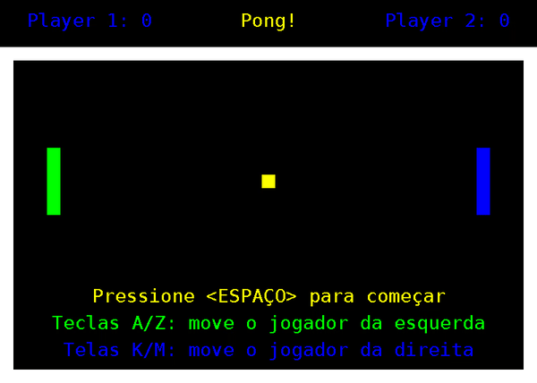

# Exercício Programa: Pong!

Implementação em Java do clássico jogo Pong, desenvolvido como exercício de programação



## Instalação

**Requisitos:**

- JDK 11 ou superior
- GNU Make (opicional)

Clone o repositório e entre na pasta criada:

```bash
git clone https://github.com/GuilhermeBalog/java-pong.git
cd java-pong
```
### Rodando com o GNU Make

Se o GNU Make está instalado, basta entrar na pasta src e executar o comando `make`:

```bash
cd src/
make
```

O GNU Make vai compilar os arquivos `.java` e rodar a classe principal `Pong`

Caso queira apenas compilar o programa, basta executar o comando `make compile`

### Rodando sem o GNU Make

Se você não possuir o GNU Make, basta compilar os arquivos manualmente e rodar:

```bash
cd src/ 
javac Ball.java Player.java Score.java
java Pong 1 true # 1 e true rodam o jogo em "safe mode", necessário pra rodar em algumas distribuições Linux
```

## Enunciado

"Você foi recentemente contratado pela *EACH Game Dev.* Co. para atuar no desenvolvimento de **Pong!** seu mais novo e aguardado lançamento. 
Entretanto, poucos dias antes do início do seu trabalho, o único desenvolvedor da equipe deixou o emprego para trabalhar na maior concorrente da empresa. 
Cabe a você agora a tarefa de finalizar o desenvolvimento do projeto **Pong!**"

O projeto **Pong!** é escrito Java, e é composto pelas seguintes classes:

- **Pong:** classe principal do jogo (contém o método `main` que gerencia o todo andamento da partida e a interação entre os demais elementos).
- **GameLib/MyFrame/MyKeyAdapter:** três classes que implementam funcionalidades gráficas (criação de janela em modo gráfico, métodos para desenhos de formas geométricas) e para processar entrada via teclado.
- **Wall:** implementa as paredes do jogo.
- **Ball:** implementa as bolas do jogo.
- **Player:** implementa os jogadores (controláveis) pelo usuários.
- **Score:** implementa o placar do jogo.

"Felizmente, algumas destas classes já estavam 100% prontas quando o antigo desenvolvedor deixou a empresa: **Pong**, **GameLib**, **MyFrame**, **MyKeyAdapter** e **Wall**. Entretanto, o antigo desenvolvedor apagou, por acidente, os códigos fontes destas classes, e só restaram os arquivos **.class**. Desta forma, não há a possibilidade modificar o comportamento destas classes, de modo que as classes restantes, que deverão ser implementadas por você,  recisam obrigatoriamente “conversar em sintonia” com as classes que já estão prontas.

Para ajudar, um esqueleto de cada uma das classes que precisam ser implementadas (Ball, Player e Score) já foi disponibilizado para você. Desta  forma, sua tarefa consiste em completar cada um dos arquivos fontes de modo que cada classe implemente o comportamento esperado delas, fazendo com que o jogo passe a funcionar de forma plena. É extremamente importante que os construtores e as declarações de métodos fornecidos nos esqueletos das classes não sejam alterados, tanto em relação ao nome, quanto em relação aos parâmetros recebidos. Juntamente com os esqueletos das classes, também foi disponibilizado para você a [documentação](https://guilhermebalog.github.io/java-pong) das mesmas em formato javadoc explicando o papel de cada método e parâmetro."

## Autor

Esse é um exercício programa proposto pelos professores [Daniel Cordeiro](http://www.each.usp.br/dc/) e [Flávio Luiz Coutinho](http://lattes.cnpq.br/3100288618568772) na matéria de Computação Orientada a Objetos, implementado por [Guilherme Balog Gardino](https://github.com/GuilhermeBalog)
